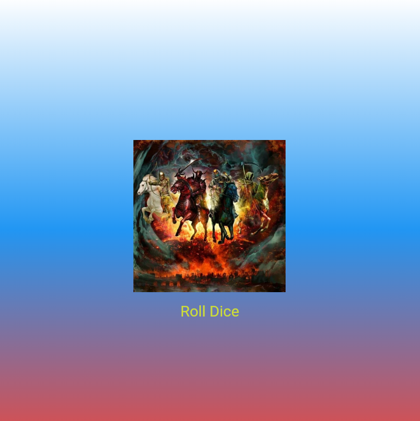

# Лабораторная работа №3. Flutter: структура UI и компонентный подход

## Информация о студенте

- **ФИО:** Alekseev
- **Группа:** ISP-232
- **Дата сдачи:** 20.03.26

## Что изучили

1. **Создание собственных виджетов** — научились выносить части UI в отдельные классы-виджеты, наследуясь от `StatelessWidget` и `StatefulWidget`, что делает код более модульным и переиспользуемым.

2. **Работа с состоянием приложения** — освоили разницу между статичными виджетами (`StatelessWidget`) и виджетами с состоянием (`StatefulWidget`), научились использовать метод `setState()` для обновления интерфейса.

3. **Передача данных через параметры** — изучили, как передавать данные в виджеты через конструкторы и параметры, что позволяет создавать гибкие и переиспользуемые компоненты.

4. **Работа с ресурсами (assets)** — научились подключать изображения в проект через файл `pubspec.yaml` и отображать их с помощью виджета `Image.asset`.

5. **Создание интерактивного интерфейса** — реализовали приложение Roll Dice с кнопкой, которая генерирует случайное число и меняет отображаемое изображение игральной кости.

## Скриншот финального приложения



## Ссылка на репозиторий

[GitHub Repository](https://github.com/okolodk/Flutter_Lab3)

## Инструкция по запуску

1. **Установите Flutter** (если ещё не установлен):
   - Скачайте Flutter SDK с [официального сайта](https://flutter.dev)
   - Добавьте Flutter в PATH

2. **Клонируйте репозиторий:**
   ```bash
   git clone https://github.com/ваш-username/Flutter_Lab3.git
   cd Flutter_Lab3
   flutter run -d edge
   flutter run
   ```

## Ответы на вопросы

### 1. Зачем выносить виджеты в отдельные файлы? Что изменится если держать всё в main.dart?

**Вынос виджетов в отдельные файлы необходим по нескольким причинам:**

- **Читаемость кода** — когда каждый виджет находится в своём файле, легче ориентироваться в проекте и находить нужный компонент
- **Переиспользование** — виджеты из отдельных файлов можно легко импортировать и использовать в других частях приложения или даже в других проектах
- **Поддержка** — проще вносить изменения и исправлять ошибки, когда код разбит на логические модули
- **Командная разработка** — разные разработчики могут работать с разными виджетами одновременно без конфликтов

**Если держать всё в main.dart:**
- Файл быстро станет огромным и нечитаемым
- Сложнее будет искать нужный код
- Невозможно переиспользовать виджеты в других местах
- Усложнится тестирование отдельных компонентов
- Появятся сложности при совместной работе

---

### 2. Что такое BuildContext? Почему метод build() принимает его как параметр?

**BuildContext** — это объект, который содержит информацию о положении виджета в дереве виджетов Flutter. Он представляет контекст, в котором строится виджет.

**Почему build() принимает BuildContext:**

- **Локализация в дереве** — BuildContext позволяет виджету знать своё местоположение в иерархии виджетов
- **Доступ к родительским виджетам** — через контекст можно получить доступ к виджетам-предкам (например, для получения тем, навигации, наследуемых данных)
- **Создание виджетов** — некоторые операции (как навигация или показ диалогов) требуют контекста для понимания, где именно в дереве выполнять действие
- **Оптимизация** — Flutter использует контекст для эффективного управления перерисовкой только тех частей UI, которые изменились

**Пример использования:**
```dart
// Навигация требует контекста
Navigator.push(context, MaterialPageRoute(...));

// Доступ к теме
Theme.of(context).primaryColor;
```

### 3. Чем StatelessWidget отличается от StatefulWidget? Приведите пример когда нужен каждый из них.

**Основные отличия:**

| Характеристика | StatelessWidget | StatefulWidget |
|----------------|------------------|------------------|
| **Состояние** | Нет состояния | Есть состояние — хранится в объекте State |
| **Перерисовка** | Только при пересоздании | По вызову setState() |
| **Когда использовать** | Статичный UI | UI, который меняется по действию пользователя |
| **Структура** | Один класс | Два класса (виджет + State) |

**StatelessWidget** используется для статичных элементов, которые не меняются после создания:
- Текст, который не изменяется
- Иконки
- Фоновые элементы
- Статичные изображения

**Пример StatelessWidget:**
```dart
class StyledText extends StatelessWidget {
  final String text;
  
  const StyledText(this.text, {super.key});
  
  @override
  Widget build(BuildContext context) {
    return Text(
      text,
      style: TextStyle(fontSize: 28, color: Colors.white),
    );
  }
}
```

**StatefulWidget** используется для динамических элементов, которые должны реагировать на действия пользователя:
* Кнопки с изменяемым состоянием
* Формы ввода
* Анимации
* Элементы, которые обновляются по нажатию (как наша игральная кость)

**Пример StatefulWidget:**

```dart
class DiceRoller extends StatefulWidget {
  const DiceRoller({super.key});
  
  @override
  State<DiceRoller> createState() => _DiceRollerState();
}

class _DiceRollerState extends State<DiceRoller> {
  var currentDice = 1;
  
  void rollDice() {
    setState(() {
      currentDice = _random.nextInt(6) + 1;
    });
  }
  
  @override
  Widget build(BuildContext context) {
    return Column(
      children: [
        Image.asset('assets/images/dice-$currentDice.png'),
        TextButton(onPressed: rollDice, child: Text('Roll Dice')),
      ],
    );
  }
}
```

### 4. Почему Random() создаётся на уровне файла, а не внутри rollDice()?

**Random() создаётся на уровне файла по следующим причинам:**

1. **Производительность** — создание нового объекта Random при каждом вызове функции (каждом нажатии кнопки) требует дополнительных ресурсов и времени. Создав один экземпляр на уровне файла, мы используем его многократно без лишних затрат.

2. **Качество случайности** — если создавать Random внутри функции rollDice(), которая вызывается быстро (несколько раз в секунду), генератор может инициализироваться одним и тем же seed (зерном), основанным на текущем времени. Это приведёт к тому, что последовательные вызовы могут давать одинаковые "случайные" числа.

3. **Лучшая практика** — создание тяжёлых объектов один раз и их переиспользование является общепринятой практикой программирования. Нет смысла создавать новый генератор случайных чисел каждый раз, когда нужно получить случайное значение.

**Пример неправильного подхода:**
```dart
// ПЛОХО: создаётся новый генератор каждый раз
void rollDice() {
  Random random = Random(); // Неэффективно!
  setState(() {
    currentDice = random.nextInt(6) + 1;
  });
}
```

**Пример правильного подхода:**
```dart
final Random _random = Random();

void rollDice() {
  setState(() {
    currentDice = _random.nextInt(6) + 1;
  });
}
```